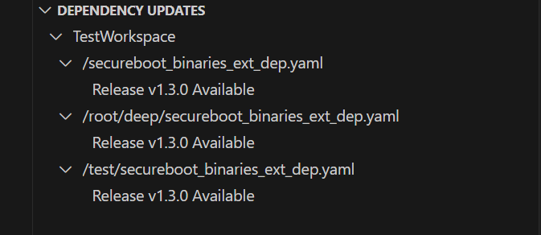

# mu-tiano-dependency-updater README

This extension adds a check for and the ability to update, available releases of assets stored in secureboot_binaries_ext_dep.yaml files. 

## Features

This extension checks the workspace for the existence of secureboot_binaries_ext_dep.yaml files, then using the information contained within, checks to see if there is a github release version newer than the one contained in the file. if so, then it shows the available update and allows the user to update the file to point at the new release. 

For example if there is an image subfolder under your extension project workspace:

> Tip: Many popular extensions utilize animations. This is an excellent way to show off your extension! We recommend short, focused animations that are easy to follow.

## Requirements

If you have any requirements or dependencies, add a section describing those and how to install and configure them.

## Extension Settings

This extension does not currently have any settings.

## Known Issues

This extension will not currently update the sha256 sum of the payload (YET!)

## Release Notes

This is the first release of the extension.

### 0.0.1

Implement detection of secureboot_binaries_ext_dep.yaml files and allow updating of release version numbers within the file.

---